# Makerfabs Home Assistant Relay 8 Channel

```c++
/*
Version:        V1.0
Author:            Vincent
Create Date:    2023/7/10
Note:

*/
```


# Equipping Items
Install the Home assistant firmware of Raspberry PI, or other platforms, and ensure that you can log in to the management page.

And install the ESPHome in the Add-on.

Version of this document:
 
``` c
ESPHome
Current version: 2023.5.1

```


Equipment Setup

1. Open the HA management page and go to the ESPHome page.

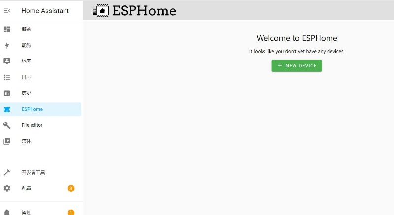

2. Select NEW DEVICE.
3. Select Continue.
4. Set a name, such as LAN_test.

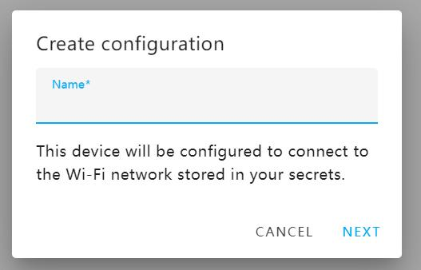

5. Select ESP32.

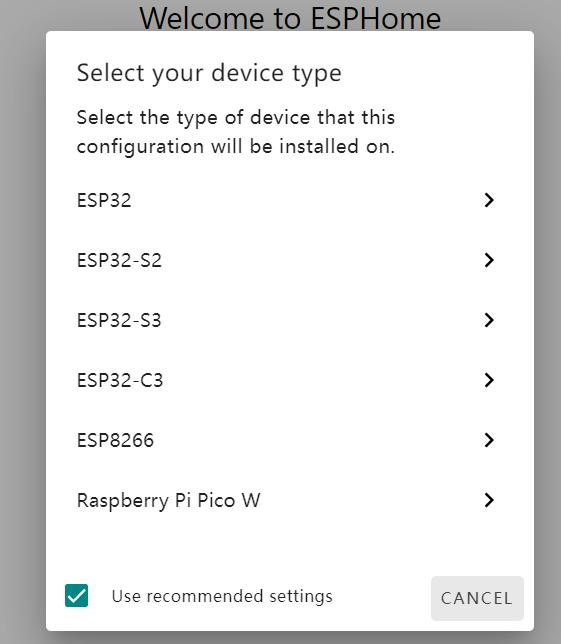
 
6. Select SKIP, you will return to the ESPHome page, you will see the device you just created.
7. Select EDIT to enter the yaml file editing page

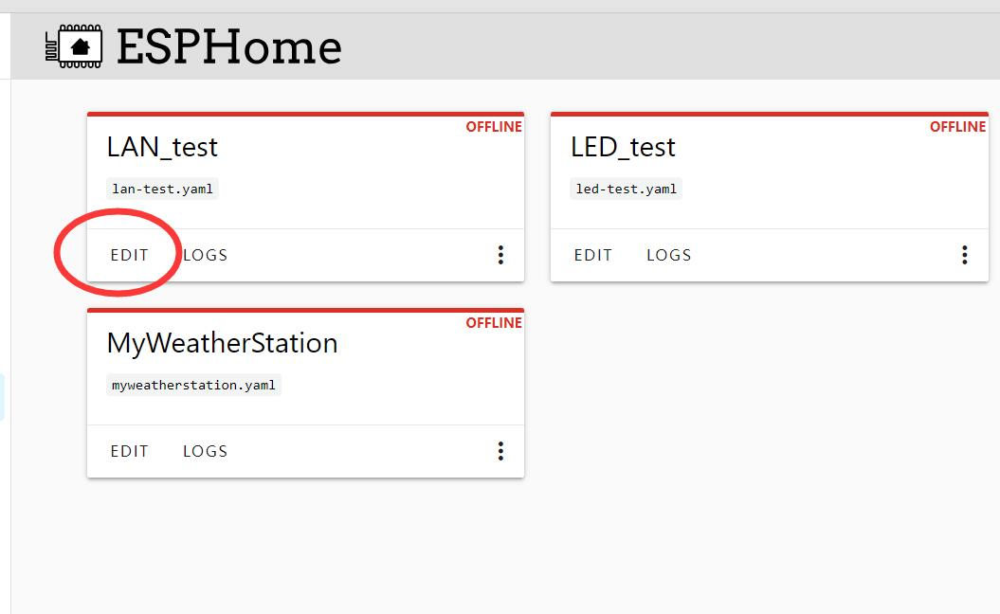

8. Copy the code relay8.yaml provided by Makerfabs to the end of the file.

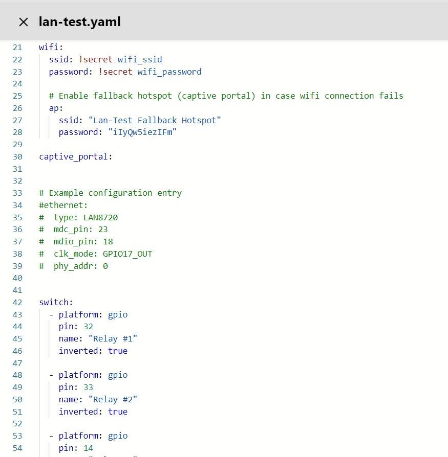

9. Select SAVE, and select Install.
10. Select Manual Download, select Modern format, the console page will be displayed, please wait patiently for compilation.

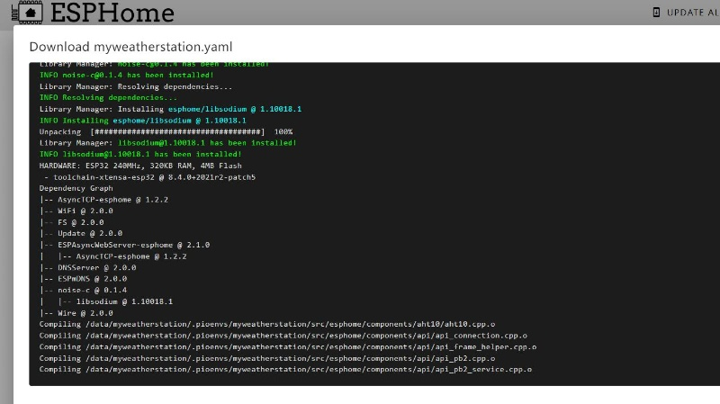

11. After the bin file is downloaded, exit.
12. Open https://web.esphome.io/?dashboard_install, go to the download page

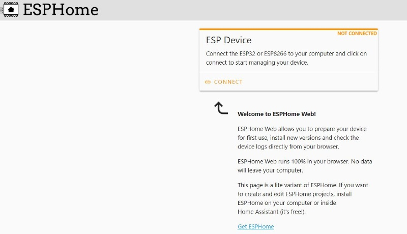

13. Select CONNECT. In the displayed page, select COM port.

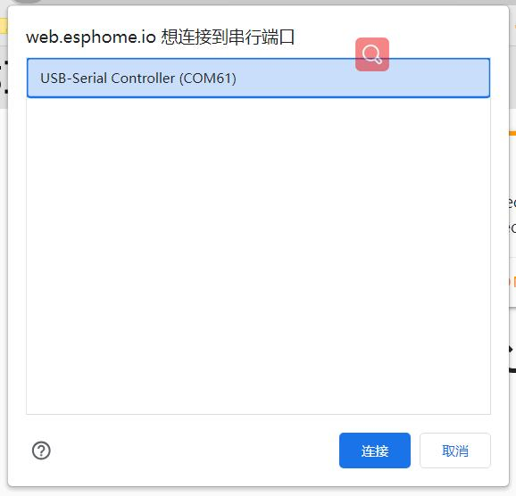

14. After the connection is successful, click INSTALL

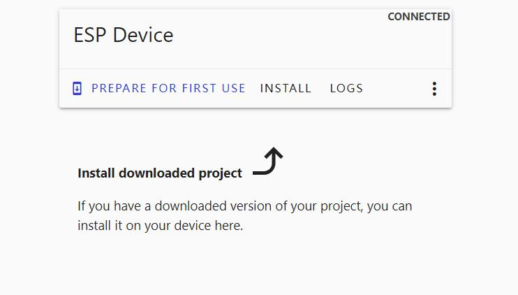

15. Select the bin file you just downloaded on the pop-up page. Click Install and wait for the installation to complete. If the connection is not successful, hold down the Flash key, then press the Reset key, and then click Download again.
16. download success, click, LOGS pop-up terminal interface, find IP information

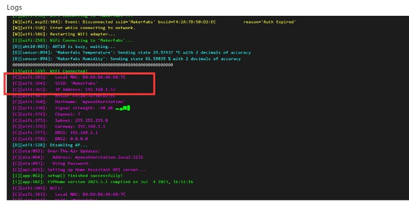

17. Go back to the ESPHome page, select EDIT for your device, and go to the YAML edit page.
18. Copy API: encryption key: the back of the content, such as “43 a0nyfb9py7aalga282lgikxkt5i7zhcmu8dhmjnea=”
19. Return to the HA page, select Configuration, and select devices and services
20. If HA automatically identifies the local device, click Configure to add the device automatically. If no, continue to add the device. This is related to the configuration of the HA router.
21. Click on the bottom right corner to add integration, search for ESPHome, and select
22. Enter the IP address you just obtained on the pop-up page, such as 192.168.1.57, and then submit.
23. Enter the key.


24. The device has been added successfully


# HA UI Setup

Normally, HA recognizes this automatically, but if the home page has been manually modified, HA will never add any device display again.

1. Go to the HA home page, click the three dots in the upper right corner, select Edit dashboard

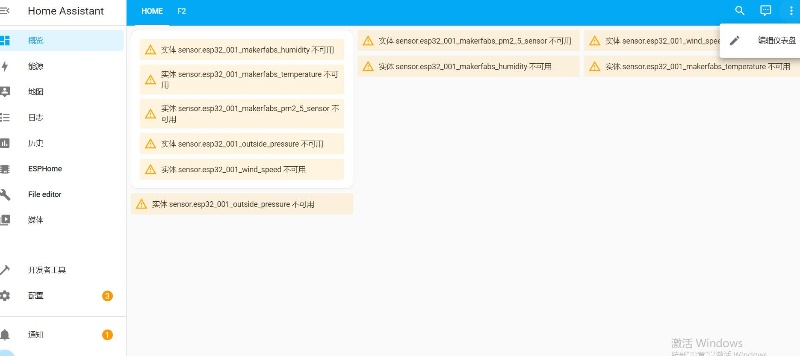

2. The color of the interface changes, select the add card in the lower right corner.
3. In the physical page there are many cards to choose from, here select a dial, click

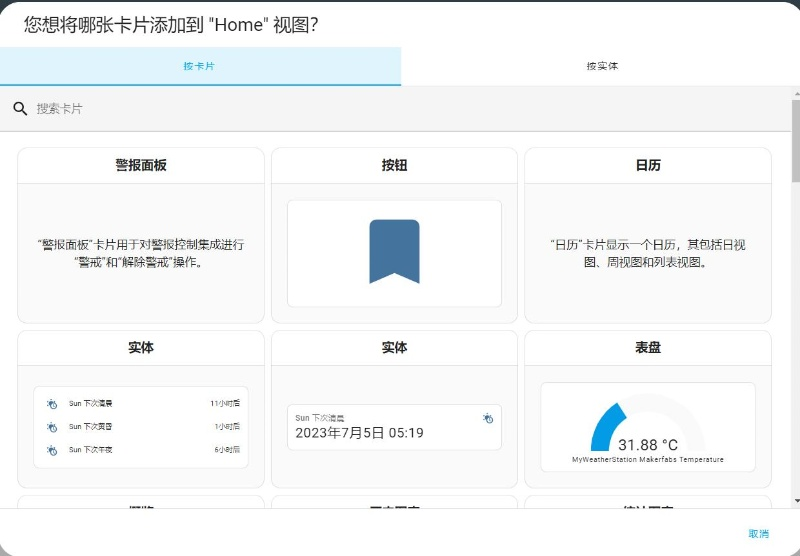

4. In the dial card configuration page, select the entity, find the relevant content of LAN_test

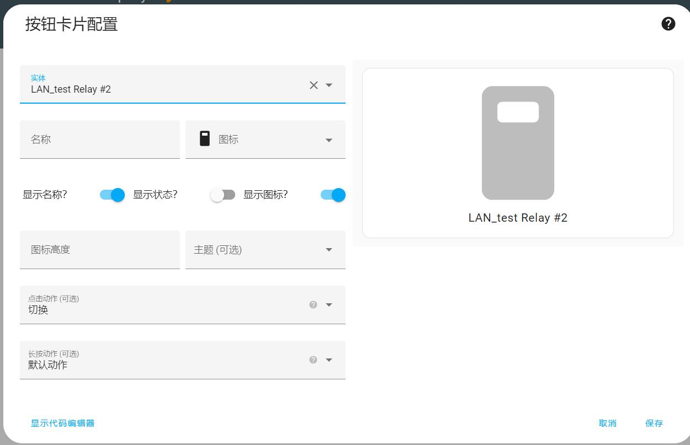

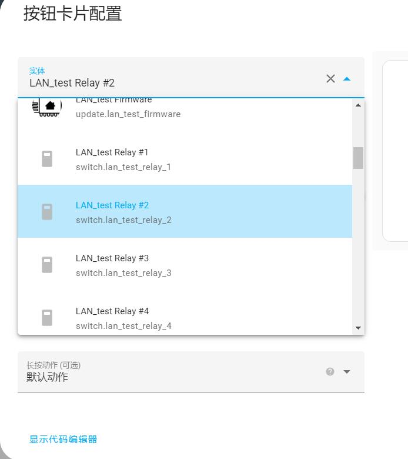

5. Save.
6. The way to add cards is the same as the use of HA, you can arrange the page by yourself.
7. Click Finish to exit editing
The reference interface is as follows:

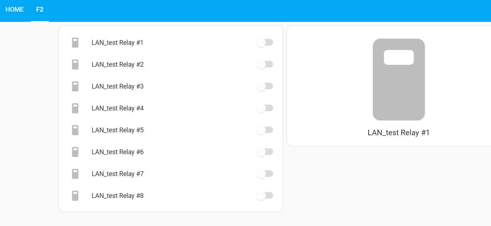


# Ethernet or WiFi

The Home Assistant supports cable connection and WiFi connection. WiFi is used by default, but the network cable connection is relatively stable and does not suffer from the shielding interference of the metal case.

The default configuration in yaml is WiFi, or no additional configuration is required.
If you want to use network cables, note out the WiFi information and add network port configuration information.

``` yaml

#wifi:
#  ssid: !secret wifi_ssid
#  password: !secret wifi_password
#
#  # Enable fallback hotspot (captive portal) in case wifi connection fails
#  ap:
#    ssid: "Lan-Test Fallback Hotspot"
#    password: "iIyQw5iezIFm"

#captive_portal:


# Makerfabs Config
ethernet:
  type: LAN8720
  mdc_pin: 23
  mdio_pin: 18
  clk_mode: GPIO17_OUT
  phy_addr: 0

```